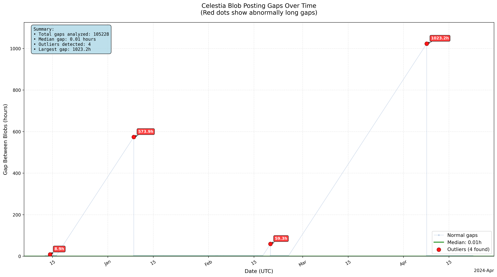
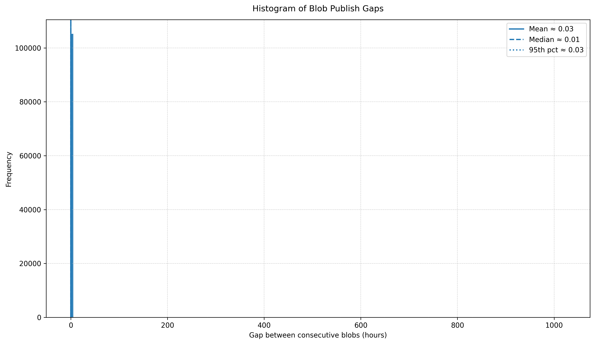

# Celestia Blob Posting Consistency Analysis

**Analysis Date:** 2025-09-12 09:47:11 UTC  
**Namespace:** `N/A`

## Executive Summary

❌ **INCONSISTENT** - High variability in posting intervals

**4 significant gaps** detected that are much longer than usual.

## Data Overview

- **Total Blobs:** 105229
- **Time Gaps Analyzed:** 105228
- **Analysis Period:** 131.5 days

- **First Blob:** 2023-12-12 19:14:28 UTC
- **Last Blob:** 2024-04-22 06:48:13 UTC

## Gap Statistics

- **Average Gap:** 108 s (0.03 h)
- **Median Gap:** 23 s (0.01 h)
- **Std Dev:** 13037 s (3.62 h)
- **Shortest Gap:** 6 s
- **Longest Gap:** 3683413 s (1023.17 h)

## Significant Gaps Identified

**Outlier Threshold:** 26181 s (7.27 h)

| Gap # | Duration (s) | Hours | Days | Before Time (UTC) | After Time (UTC) |
|------:|-------------:|------:|-----:|-------------------|------------------|
| 4116 | 32159 | 8.9 | 0.4 | 2023-12-13 21:01:01 | 2023-12-14 05:57:01 |
| 11595 | 2066173 | 573.9 | 23.9 | 2023-12-16 02:31:30 | 2024-01-09 00:27:43 |
| 41948 | 213585 | 59.3 | 2.5 | 2024-02-17 14:31:12 | 2024-02-20 01:50:57 |
| 48044 | 3683413 | 1023.2 | 42.6 | 2024-02-25 12:52:25 | 2024-04-08 04:02:38 |

## Visual Analysis

---
*Report generated automatically.*
